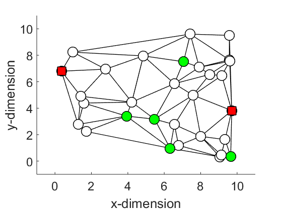
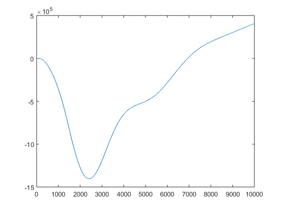

## Morphological Computation

Based on [Matlab Morphological Computation Simulation](https://github.com/helmuthauser/Matlab_Morphological_Computation_Simulation) GitHub repo.

Full explaination on [Towards a theoretical foundation for morphological computation with compliant bodies](https://link.springer.com/article/10.1007%2Fs00422-012-0471-0?LI=true).

#### Requires

Try and run main.m, then you will have to install the following:

- Matlab: Neural Network Toolbox


#### Build
- Load the `main.m` file and run it.
- Wait about 5 minutes to train the neural network.
- You should see the following information outputted along with the following graphs.




The nodes (masses) are connected by nonlinear springs. The red nodes are fixed in order to hold the network in place. The green nodes are randomly chosen inputs nodes, which receive the input in form of horizontal forces scaled by randomly initiated weights.




```
main
Running scripts...
Adding necessary paths
 i = 1000 of 200001
 i = 2000 of 200001
 ...
 i = 200001 of 200001
> In learning_Volterra (line 74)
  In main (line 10)
Warning: Rank deficient, rank = 24, tol =  7.674805e-08.
 i = 1000 of 15000
 i = 2000 of 15000
 ...
 i = 14000 of 15000
 i = 15000 of 15000
MSE: 0.095248
step response
 i = 1000 of 10000
 i = 2000 of 10000
 ...
 i = 9000 of 10000
 i = 10000 of 10000
plotting

ans =

  struct with fields:

     O: [10000×1 double]
     D: [10000×77 double]
    Sx: [10000×30 double]

```
